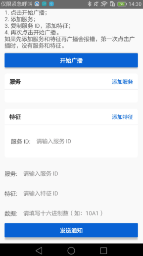
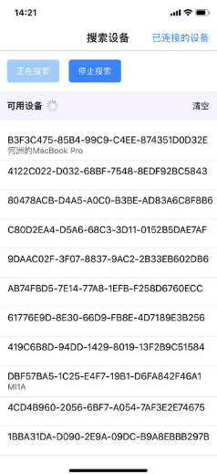
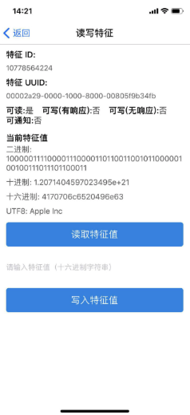

# react-native-ble-demo

React Native 中使用 BLE 的示例项目。项目包含两个部分，一个是中心设备，另一个是外设。中心设备用来扫描并连接可用的外设，然后读取和写入数据。外设则广播自己，因此中心设备可以搜索并连接自己，还负责处理中心设备的读取和写入数据，同时通过通知的方式主动发送数据给中心设备。

其中，外设只支持在 Android 设备上运行。

## 如何使用

在 Android 设备上运行 `ble_peripheral`：

```bash
$ cd ble_peripheral
$ react-native run-android
```

在另外一台 iOS 或 Android 设备上运行 `ble_central`：

```bash
$ cd ble_central
$ react-native run-ios # or react-native run-android
```

### 外设

外设程序基于 [react-native-ble-peripheral](https://github.com/himelbrand/react-native-ble-peripheral) 实现。

打开应用后，会添加一个服务和特征，点击“开始广播”按钮后，广播蓝牙信息，设备就可以被搜索到。填写特征数据，点击发送通知按钮可以发送数据给中心设备。

备注：广播数据有大小限制（最大 31 字节），如果超过限制则无法正常广播。参考：https://developer.android.com/reference/android/bluetooth/le/AdvertiseCallback

<div align=center>

</div>

### 中心设备

中心设备基于 [react-native-ble-plx](https://github.com/Polidea/react-native-ble-plx) 实现。

<div align=center>


</div>

支持的功能：
- 扫描设备
- 连接设备
- 读取和写入特征

### 在同一台电脑上调试

如果想要在同一台电脑上调试，需要修改其中一个程序的默认端口号。例如，可以让外设程序在 `8082` 端口上运行：
```bash
$ react-native run-android --port=8082
```